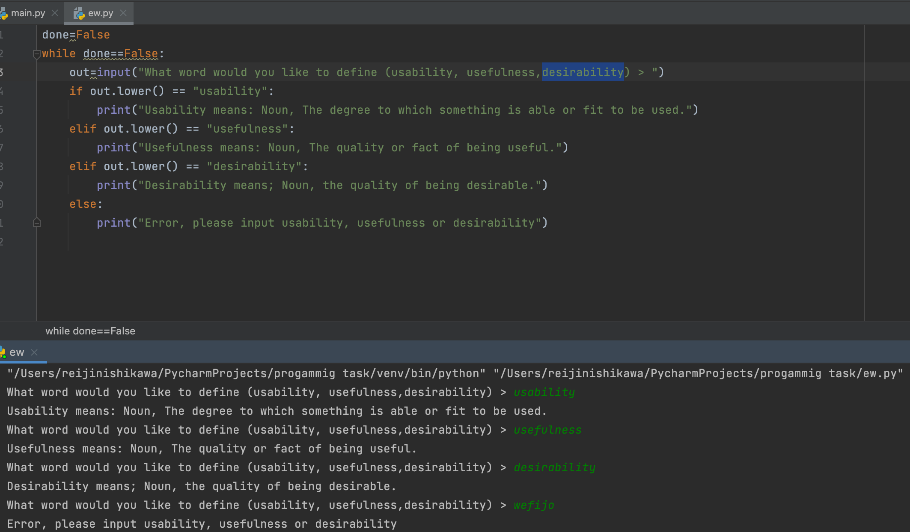

# Create a program that shows the definition of the terms usability, usefulness and desirability based on the user’s input.

Examples
UX_terms(“usability”) → “Usability is … ”

```.py
done=False
while done==False:
    out=input("What word would you like to define (usability, usefulness,desirability) > ")
    if out.lower() == "usability":
        print("Usability means: Noun, The degree to which something is able or fit to be used.")
    elif out.lower() == "usefulness":
        print("Usefulness means: Noun, The quality or fact of being useful.")
    elif out.lower() == "desirability":
        print("Desirability means; Noun, the quality of being desirable.")
    else:
        print("Error, please input usability, usefulness or desirability")
```
# Output:



